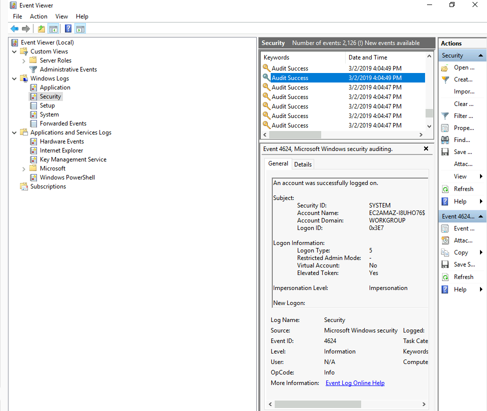
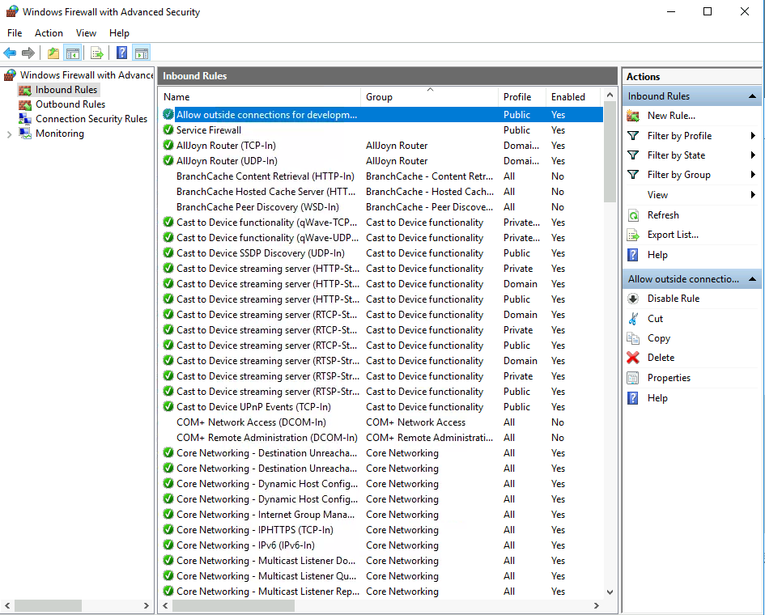
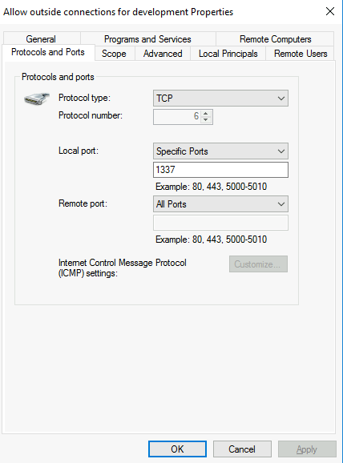
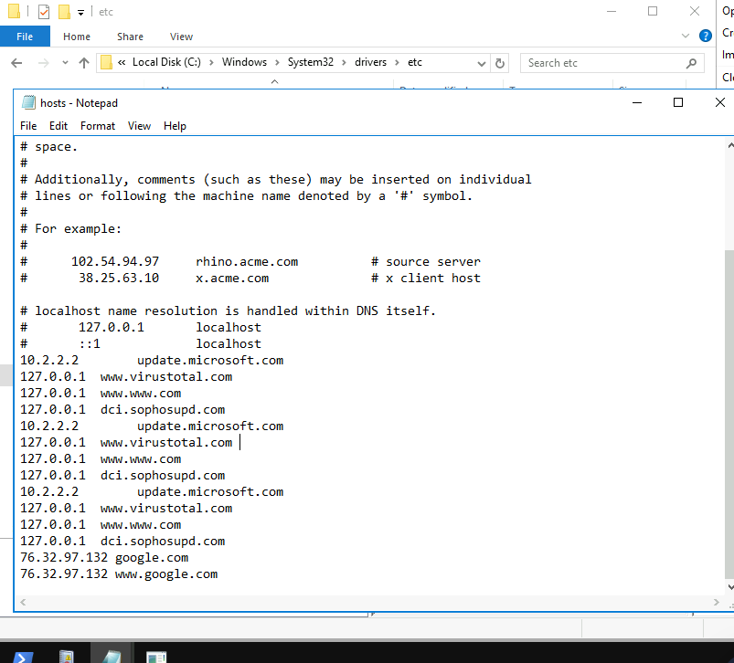

# Investigating Windows

A windows machine has been hacked, its your job to go investigate this windows machine and find clues to what the hacker might have done.

<hr>
<pre>
This is a challenge that is exactly what is says on the tin, there are a few challenges around investigating a windows machine that has been previously compromised.

Connect to the machine using RDP. The credentials the machine are as follows:

Username: Administrator
Password: letmein123!
</pre>
<hr>

#### Q1. Whats the version and year of the windows machine?

Simply open the powershell, and use systeminfo to get all the required information about the machine.

```
PS C:\Windows\system32> systeminfo

Host Name:                 EC2AMAZ-I8UHO76
OS Name:                   Microsoft Windows Server 2016 Datacenter
OS Version:                10.0.14393 N/A Build 14393 
..
.
.

```

Here , windows machine is of ```Windows Server 2016```
<hr>

#### Q2. Which user logged in last?

net user command can be used to check the users in machine. We can check one by one which user has what last logon they had , it will show up at the end as Last logon, but there must be a quicker way for it so I searched and found...
```
PS C:\Windows\system32> Get-LocalUser | Select-Object Name, LastLogon
Name           LastLogon
----           ---------
Administrator  10/27/2023 10:08:33 AM
DefaultAccount
Guest                                                                                       
Jenny
John           3/2/2019 5:48:32 PM  
```

Here we can see ```Administrator``` had the last login.
<hr>

#### Q3. When did John log onto the system last?

Answer format: MM/DD/YYYY H:MM:SS AM/PM

From above we can see John logged in at ```03/02/2019 05:48:32 PM```
<hr>

#### Q4. What IP does the system connect to when it first starts?


(from online writeup, The Registry Editor window will pop up. Follow this path, HKEY_LOCAL_MACHINE > SOFTWARE > Microsoft > Windows > CurrentVersion > Run. Once you reach that location, you will see two values. The UpdateSvc looks sus, checking it out reveals the IP address that the remote machine connects to when it starts up.)


IP it connects to is ```10.34.2.3```

<hr>

#### Q5. What two accounts had administrative privileges (other than the Administrator user)?

Similar to Q2 this can be done by checking each user using net user commmand but I didn't find any quicker way for this so I just checked for all one by one, they show up as
```
Local Group Memberships      *Administrators 
```
Accounts having Administrators memberships are Administrator, Jenny and Guest.

So answer is ```Jenny, Guest```

<hr>

#### Q6. Whats the name of the scheduled task that is malicous.

I was stuck here for a while, then I just used GUI to open ```Task Scheduler```, in which I opened ```Task Scheduler Library```

Here,


under actions tab we could see what each of these is doing.

Here, ```GameOver``` having action ```C:\TMP\mim.exe sekurlsa::LogonPasswords > C:\TMP\o.txt```
and  ```Clean file system``` having action ```C:\TMP\nc.ps1 -l 1348```
seem highly sus.

From answer format, we can figure out that required task is indeed ```Clean file system```.

<hr>

#### Q7. What file was the task trying to run daily?

Just went inside Task Scheduler, saw triggers for Scheduled tasks, 
```clean file system``` is scheduled to run at 4:55pm everyday, in it's actions we see ```C:\TMP\nc.ps1 -l 1348``` being run.

<hr>

#### Q8. What port did this file listen locally for?

From ```C:\TMP\nc.ps1 -l 1348``` port is 1348.

<hr>

#### Q9. When did Jenny last logon?
Using ```C:\Windows\system32> Get-LocalUser | Select-Object Name, LastLogon``` again, we see there is no LastLogon for Jenny, so it's  ```never```.

<hr>

#### Q10. At what date did the compromise take place?

Little bit of trial and error, but finally got the date correct as ```03/02/2019``` as it was the date on which C:\TMP folder was made and also the last logon date of John
<hr>

#### Q11. During the compromise, at what time did Windows first assign special privileges to a new logon?

Answer format: MM/DD/YYYY HH:MM:SS AM/PM

Hint: 00/00/0000 0:00:49 PM

Using the hint and known compromise date, we check event logs in Security and, I basically looked for first time in 03/02/2019 which ended at 49 seconds, thankfully not many and we got one in Logon/Special Logon category.

](image.png)


<hr>

#### Q12. What tool was used to get Windows passwords?

Remember the mim.exe that autostarts, yeah. Can be found in ```C:\TMP\``` , mim-out file confirms any doubt. Time to read about ```mimikatz```.

<hr>

#### Q13. What was the attackers external control and command servers IP?

Solved with Q15.

<hr>

#### Q14. What was the extension name of the shell uploaded via the servers website?

no idea, opened writeup, just had to know ```C:\ipubnet```

It is a folder that contains the website content and web apps. The website content and web apps are kept organized and secure in this folder. What’s more, it is the default folder for Microsoft Internet Information Services (IIS). IIS also allows multiple domains to be provided from an inetpub folder.

How Does the Inetpub Folder Work?

The inetpub folder is located in the C drive and possesses 5 subfolders, which has been listed below:

    * Adminscripts, the home of administration scripts, allows you to automate server administration tasks and remotely administer websites provided from inetpub folder.
    * Iissamples contains sample applications that enable developers to understand how websites and web applications work. The content is only for demonstration purposes. Using any sample site on a running IIS Web server puts the computer at risk.
    * Mailroot and its associated subfolders are used to handle mail SMTP services.
    * Scripts contains web applications that add functionality to websites.
    * Wwwroot contains all web pages and content that will be published on the web. This is the default directory for publishing web pages.
thanks [here](https://www.minitool.com/news/what-is-inetpub-folder.html)

so here's a Jakarta Server Pages ```.jsp``` file inside wwwroot (Apparently something to create web applications using html and jsp tags)
<hr>

#### Q15. What was the last port the attacker opened?
TIme to open firewall. 




When I did this, I just checked the first one, assuming latest. Proper way to do this might have been to actually filter by ```Filter by group > Rules without a group``` which reduces the rule size significantly. 

Anyway port ```1337```.
<hr>

#### Q16. Check for DNS poisoning, what site was targeted?

So apparently windows has a file at ```C:\Windows\system32\drivers\etc\hosts``` . 

 This file contains the mappings of IP addresses to host names. Each entry should be kept on an individual line. The IP address should
be placed in the first column followed by the corresponding host name.
The IP address and the host name should be separated by at least one
space.



```google.com```(Q15) is targeted and it's IP is mapped to ```76.32.97.132``` (Q12)